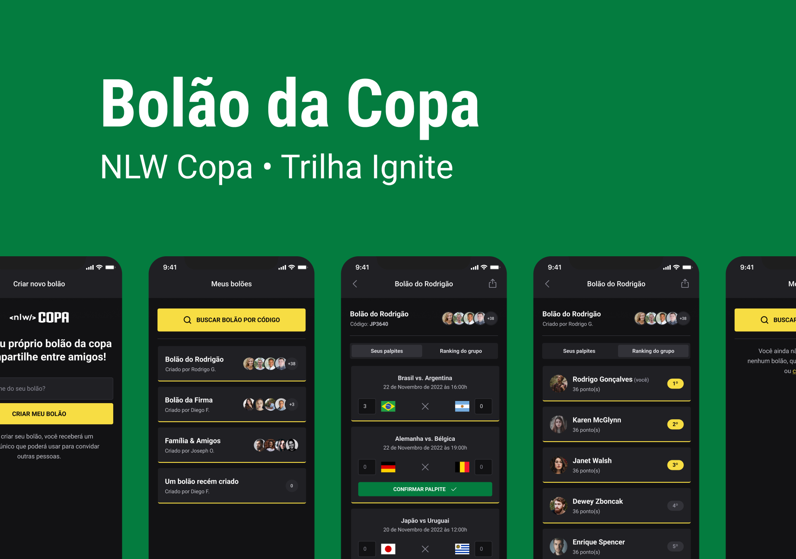
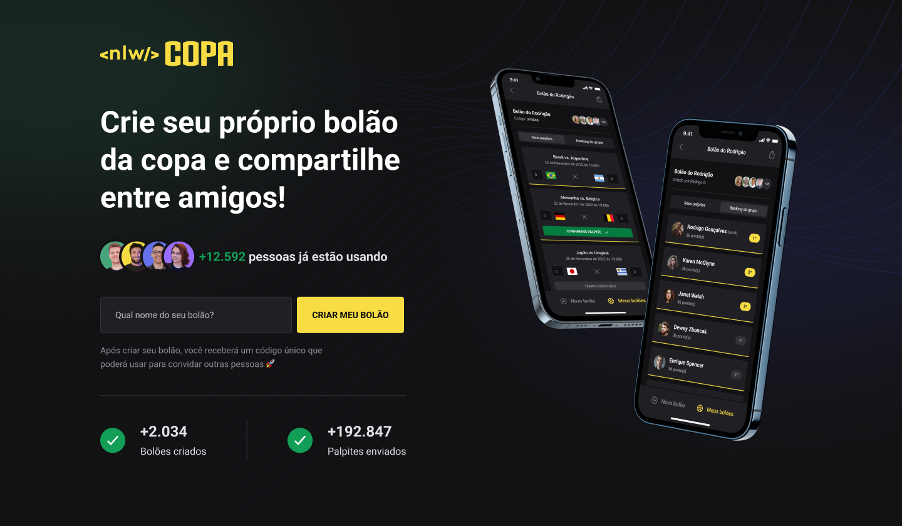
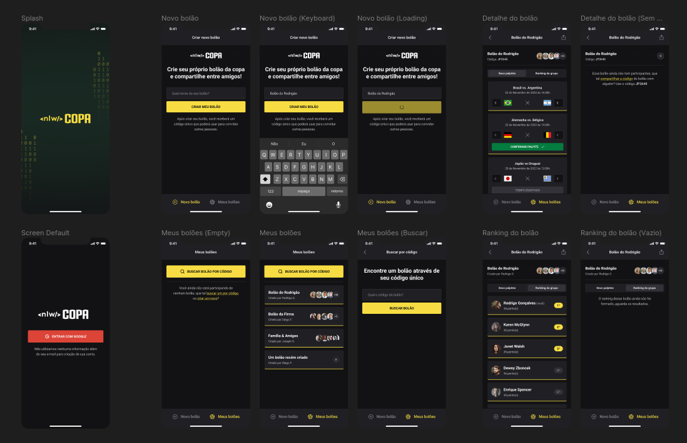

<h1 align="center">
    
</h1>

<p>

</p>
<br/>

<p align="center">
  <a href="#-about">About</a>&nbsp;&nbsp;&nbsp;|&nbsp;&nbsp;&nbsp;
  <a href="#-layout">Layout</a>&nbsp;&nbsp;&nbsp;|&nbsp;&nbsp;&nbsp;
    <a href="#-tech-stack">Tech Stack</a>&nbsp;&nbsp;&nbsp;|&nbsp;&nbsp;&nbsp;
  <a href="#-how-it-works">How it works</a>&nbsp;&nbsp;&nbsp;|&nbsp;&nbsp;&nbsp
  <a href="#-license">License</a>
</p>

## 💻 About
NLW cup is a web and mobile application in which each user can create a world cup pool and invite their friends to participate. This project was developed during Rocketseat's Next Level Week event on the Ignite trail, under the guidance of Diego Fernandes and Rodrigo Gonçalves.

___

## 🎨 Layout
The application layout is available on Figma [link](https://www.figma.com/file/NMfJggHkIliARLfSWdwkpa/Bol%C3%A3o-da-Copa-(Community)?node-id=316%3A2316).

## Web

  

---
  
## Mobile
  

  ___

## 🛠 Tech Stack


The following tools were used in the construction of the project:

- [Javascript](https://developer.mozilla.org/pt-BR/docs/Web/JavaScript)
- [Typescript](https://www.typescriptlang.org/)
- [Node.js](https://nodejs.org/en/)
- [Fastify](https://www.fastify.io/)
- [zod](https://github.com/colinhacks/zod)
- [short-unique-id](https://www.npmjs.com/package/short-unique-id)
- [ReactJs](https://reactjs.org)
- [Next](https://nextjs.org/)
- [axios](https://axios-http.com/ptbr/docs/intro)
- [dotenv](https://www.npmjs.com/package/dotenv)
- [Native-base](https://nativebase.io/)
- [ReactNative](https://reactnative.dev)
- [Expo](https://expo.dev/)
- [React-navigation](https://reactnavigation.org/)
- [Tailwindcss](https://tailwindcss.com/)
- [Phosphoricons](https://phosphoricons.com/)
- [Prisma ORM](https://www.prisma.io//)
- [Vite](https://vitejs.dev/)

## 🚀 How it works

This project is divided into three parts:
1. Backend (server folder)
2. Frontend (web folder)
3. Mobile (mobile folder)

💡 Both Frontend and Mobile need the Backend to be running to work.

### Pre-requisites

Before you begin, you will need to have the following tools installed on your machine:
[Git] (https://git-scm.com), [Node.js] (https://nodejs.org/en/).
In addition, it is good to have an editor to work with the code like [VSCode] (https://code.visualstudio.com/)

#### 🎲 Running the Backend (server)

```bash

# Clone this repository
$ git clone git@github.com:exodogurgel/nlw-copa-ignite.git

# Access the project folder cmd/terminal
$ cd nlw-copa-ignite

# go to the server folder
$ cd server

# install the dependencies
$ npm install

# Run the application in development mode
$ npm run dev

# The server will start at port: 3333 - go to http://localhost:3333

```

#### 🧭 Running the web application (Frontend)

```bash

# Go to the Front End application folder
$ cd web

# Install the dependencies
$ npm install

# Run the application in development mode
$ npm run dev

# The application will open on the port: 3000 - go to http://localhost:3000

```

📱 Running the mobile app (Mobile)

```bash

# Go to the mobile application folder
$ cd mobile

# Install the dependencies
$ npm install

# Run the application in development mode
$ npx expo start

```

---
## 🦸 Author

<a href="https://blog.rocketseat.com.br/author/exodo/">
  
 <br />
 <sub><b>Êxodo Gurgel</b></sub></a> <a href="https://blog.rocketseat.com.br/author/exodo/" title="Rocketseat"></a> 🚀
 <br />

[](https://www.linkedin.com/in/exodo-gurgel/) 
[](mailto:exodowellis@gmail.com)

---

## 📝 License

This project is under the license [MIT](./LICENSE).

Made with ❤️ by Êxodo Gurgel 👋🏽 [Get in Touch!](Https://www.linkedin.com/in/exodo-gurgel/)
